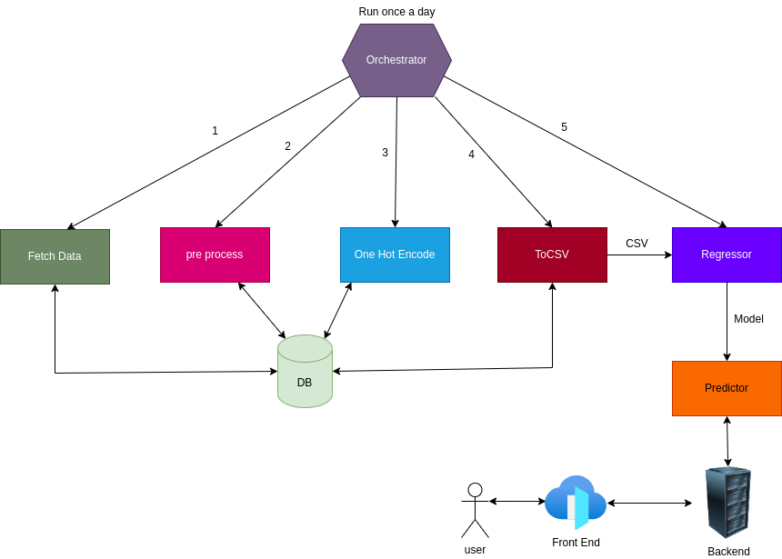
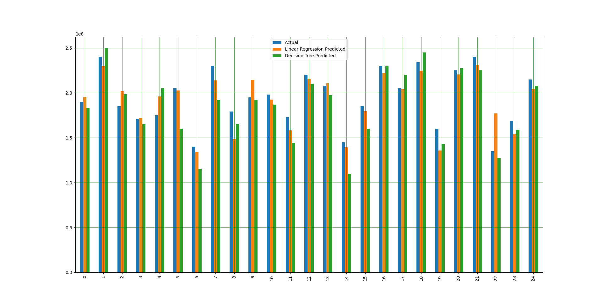
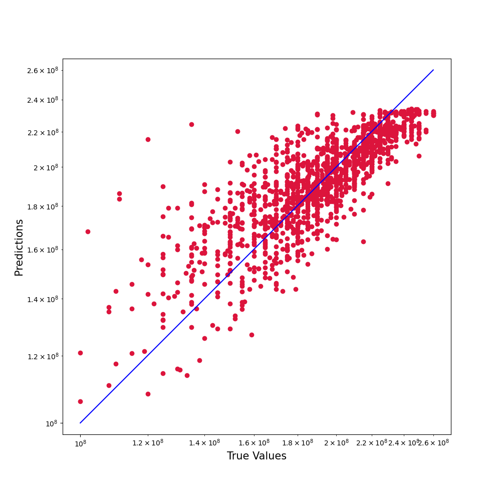

# carify

Cost prediction system powered by machine learning algorithms like linear regression and random Forrest regressor. Seeded with the car data of the Iran market. It has the capability of retrieving data periodically to keep things up-to-date. Developed in the microservices-style architecture consisting of the following services:

* Data gathering
* Pre processing
* One-Hot encoding
* Regression model training
* Predictor
* CSV convertor
* Back-End
* Front-End
* Orchestrator
* Plotting
  
## Architecture

## Linear Regression vs Decision Tree

## Linear Regression Accuracy

## Authors

* [Mehdi Eidi](https://github.com/mehdieidi)
* [Reyhaneh Golizadeh](https://github.com/ReyhanehGholizade)